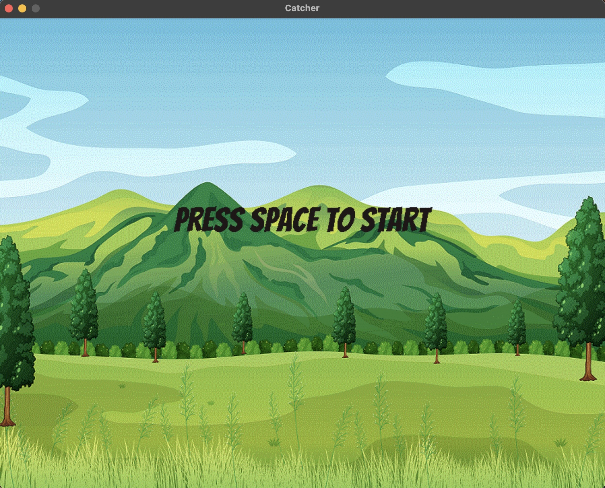
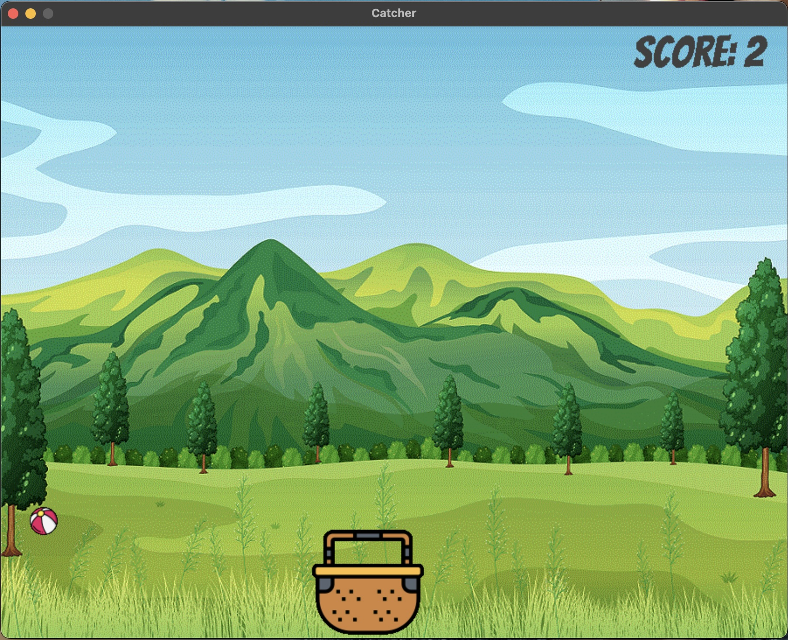

# 🎯 Catcher Game

A simple and fun arcade-style game built with **Python** and **Pygame**. Control a basket to catch falling balls. Score increases with every catch. The game ends if a ball hits the ground. Press **Spacebar** to start and use **arrow keys** to move!

---

## 🕹️ Controls

- **⬅️ / ➡️** — Move basket
- **Spacebar** — Start the game

---

## 📸 Screenshots

### Start Screen



### Gameplay



---

## ▶️ How to Run

1. Install [Python](https://www.python.org/downloads/)
2. Install `pygame` using pip3:
   ```bash
   pip3 install pygame
